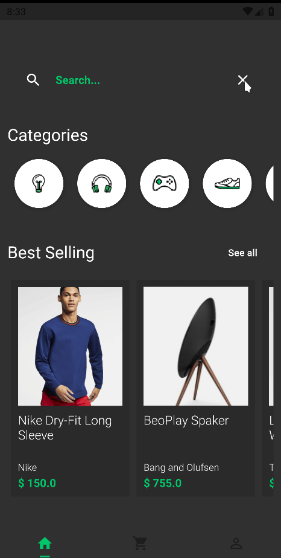
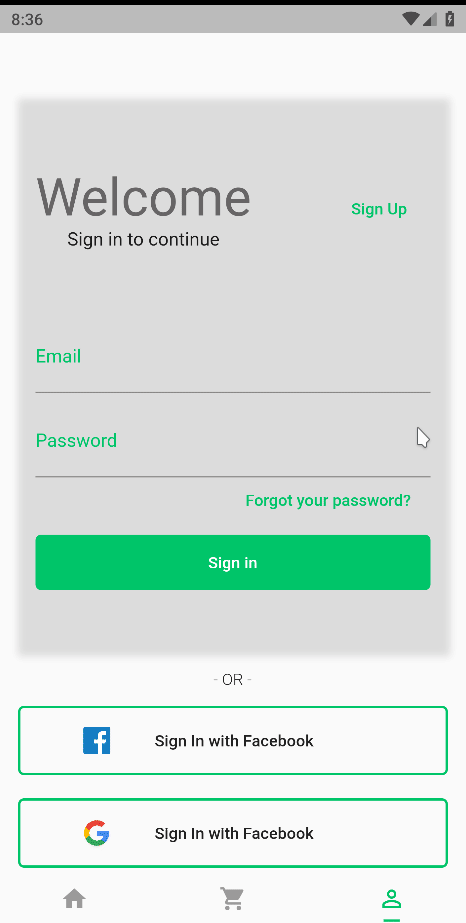

<div align="center" >
  
</div>
<h1 align="center" >
    Store UI App
</h1>

<h4 align="center">
  Venha conferir o design para aplicativo de uma loja virtual!
</h4>
<div align="center" >
  

  
</div>

<p align="center">
  <a href="#large_blue_diamond-sobre">Sobre</a>&nbsp;&nbsp;&nbsp;|&nbsp;&nbsp;&nbsp;
  <a href="#large_blue_diamond-conteudo-estudado">Conteúdo estudado</a>&nbsp;&nbsp;&nbsp;|&nbsp;&nbsp;&nbsp;
  <a href="#large_blue_diamond-tecnologias">Tecnologias</a>&nbsp;&nbsp;&nbsp;|&nbsp;&nbsp;&nbsp;
  <a href="#large_blue_diamond-como-utilizar">Como instalar</a>&nbsp;&nbsp;&nbsp;|&nbsp;&nbsp;&nbsp;
  <a href="#large_blue_diamond-para-fazer">Para fazer</a>
</p>
<br/>

## :large_blue_diamond: Sobre

Neste projeto foi desenvolvido o design para um aplicativo de uma loja virtual. Foi desenvolvido o layout das páginas de login, signup, página de vendas principal, detalhes do produto e carrinho de compras. Utilizando conceitos de temas, foram desenvolvidos os temas dark e light.

O objetivo aqui foi desenvolver apenas as interfaces, por isso não há consumo de serviços ou funcionalidades de negócio na aplicação.

Este projeto foi desenvolvido no curso Dominando Layouts no Flutter, do [Balta.io](https://balta.io/).
<br/>
<br/>

## :large_blue_diamond: Conteudo estudado

Neste projeto de estudo foram vistos os seguintes conteúdos:

- Utilização dos widgets do Flutter (Material Design)
- Construção de layouts e interfaces
- Organização e componentização de widgets
- Utilização de animações de componentes e telas
- Temas no flutter: dark e light mode
- Geração de ícones (launcher icon)
  <br/>
  <br/>

## :large_blue_diamond: Tecnologias

Este projeto foi desenvolvido com as seguintes tecnologias

- [Flutter](https://flutter.dev/)
- [Flutter Launcher Icons](https://pub.dev/packages/flutter_launcher_icons)
- [VS Code][vc]
  <br/>
  <br/>

## :large_blue_diamond: Como utilizar

Para rodar a aplicação você precisa ter o [Git](https://git-scm.com) e [Flutter](https://flutter.dev/) na sua máquina. Você precisará também de um emulador para Android ou IOS.
Como sugestão, utilize o emulador Android do [Android Studio](https://developer.android.com/studio) ou o [Genymotion](https://www.genymotion.com/).

Abra seu emulador e siga os comandos abaixo em seu terminal:

```bash
# Clone this repository
$ git clone https://github.com/agnaldoburgojr/store-ui-app.git storeUiApp

# Go into the repository
$ cd storeUiApp

# Run the app
$ flutter run
```

<br/>

## :large_blue_diamond: Para fazer

Algumas próximas tarefas a fazer:

- Redesign do card de produtos;
- Melhorar a página de detalhes de produto;
- Ajustar espaçamentos de componentes;

<br/>

## :large_blue_diamond: Licença

Este projeto possui Licença MIT. Olhe [LICENSE](https://github.com/agnaldoburgojr/store-ui-app/blob/master/LICENCE) para mais informações.

<br/>

---

Feito com ♥ por Agnaldo Burgo Junior :wave: [Get in touch!](https://www.linkedin.com/in/agnaldo-burgo-junior/)

[vc]: https://code.visualstudio.com/
